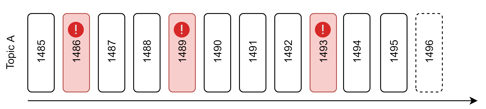
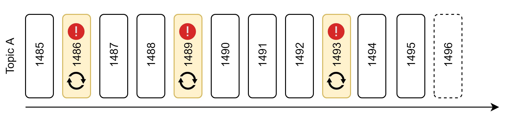
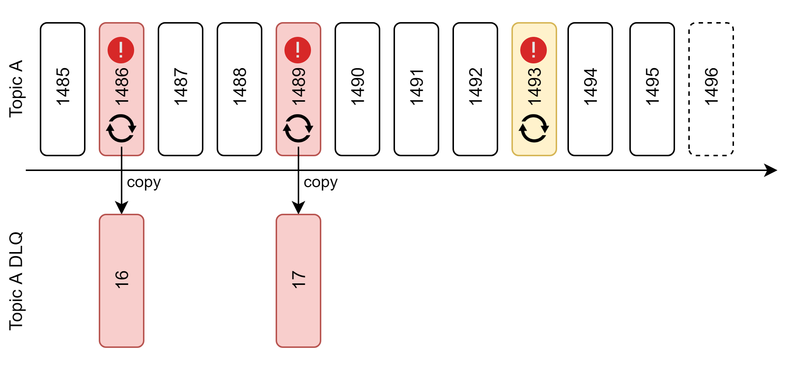
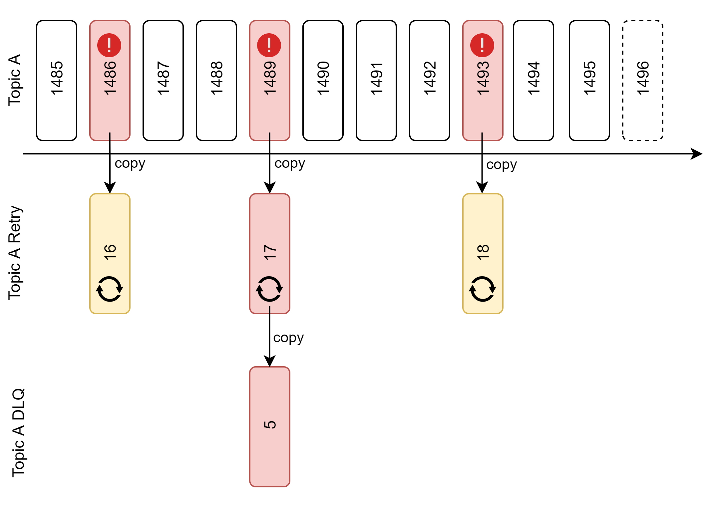

# Wprowadzenie

W każdym dostatecznie złożonym systemie informatycznym dochodzimy w pewnym momencie do miejsca, w którym musimy sobie odpowiedzieć na pytanie: a co jeśli coś pójdzie nie tak. Jeśli mamy szczęście, to może się okazać, że rozwiązania, które wybraliśmy, dostarczają nam gotowe narzędzia do radzenia sobie w sytuacjach wyjątkowych. Może też się okazać, że nie mieliśmy tyle szczęścia i wybraliśmy Kafkę. Historia o tym jak zrealizowaliśmy niezawodne dostarczanie zdarzeń w Apache Kafka oparte o ponawianie i DLQ. 


# Jak sobie radzić z błędami
 
## brak

 
## ponawianie

 
## eventy zależne (topic final(loop), topic final dlq)
 
 
## eventy niezależne (topic external, topic external retry(loop), topic external dlq)


# Dlaczego w kafce nie ma DLQ
RabbitMQ i ActiveMQ mają   Smart Broker / Dumb Consumer. Kafka ma   Dumb Broker / Smart Consumer

# Rozwiązanie oparte o topic DLQ

## Konsument głównego topica

```java
    @KafkaListener(topics = "${topic.main}")
    public void consumeFromMainTopic(String message,
                                     @Header(KafkaHeaders.RECEIVED_MESSAGE_KEY) String key,
                                     @Header(KafkaHeaders.OFFSET) String offset) {
        log.info("Consume from main topic [key={}, offset={}, message={}]", key, offset, message);
        Message serializedMessage;
        try {
            serializedMessage = objectMapper.readValue(message, Message.class);
            restTemplate.getForEntity(POSTMAN_RESOURCE_URL + serializedMessage.getAction(), String.class);
            log.info("Done processing [key={}, offset={}]", key, offset);
        } catch (Exception e) {
            log.error("Cannot handle message: {}", e.getMessage());
            copyMessageToRetry(message);
        }
    }
```

## Konsument topica do ponawiania

```java
    @KafkaListener(topics = "${topic.retry}")
    public void consumeFromRetryTopic(String message,
                                      @Header(KafkaHeaders.RECEIVED_MESSAGE_KEY) String key,
                                      @Header(KafkaHeaders.OFFSET) String offset) {
        log.info("Consume from retry topic [key={}, offset={}, message={}]", key, offset, message);
        Message serializedMessage;
        long loop = 1;
        boolean success = false;
        while (loop <= 3 && !success) {
            try {
                serializedMessage = objectMapper.readValue(message, Message.class);
                Thread.sleep(loop * 500);
                log.info("Retrying message in loop {}", loop);
                restTemplateForRetrying.getForEntity(POSTMAN_RESOURCE_URL + serializedMessage.getAction(), String.class);
                success = true;
                log.info("Done processing [key={}, offset={}]", key, offset);
            } catch (Exception e) {
                log.error("Cannot handle message {}", e.getMessage());
            }
            loop++;
        }
        if (!success) {
            copyMessageToDlq(message);
        }
    }
```

## Konsument DLQ

```java
    @KafkaListener(topics = "${topic.dlq}")
    public void consumeFromDlqTopic(String message,
                                    @Header(KafkaHeaders.RECEIVED_MESSAGE_KEY) String key,
                                    @Header(KafkaHeaders.OFFSET) String offset) {
        log.error("Consume from DLQ topic [key={}, offset={}, message={}]", key, offset, message);
    }
```

## Poprawnie przetworzona wiadomość

```
Consume from main topic [key=1, offset=0, message={
    "id" : "5dad21b1-9f5c-4b67-a583-dfad8b00b0b5",
    "action" : "0"
}]
Done processing [key=1, offset=0]
```
## Wiadomość ponawiana - poprawnie przetworzona

```
Consume from main topic [key=1, offset=2, message={
    "id" : "646ad855-fe50-4e96-ba1e-78dfa939acef",
    "action" : "1"
}]
Cannot handle message: I/O error on GET request for "https://postman-echo.com/delay/1": Read timed out
Copying message [target=external-retry, key=2019-09-01]
Consume from retry topic [key=2019-09-01, offset=1, message={
    "id" : "646ad855-fe50-4e96-ba1e-78dfa939acef",
    "action" : "1"
}]
Retrying message in loop 1
Done processing [key=2019-09-01, offset=1]
```

## Wiadomość w DLQ

```
Consume from main topic [key=1, offset=3, message={
    "id" : "77954f26-583b-4e55-9fe8-2a1f7c204541",
    "action" : "5"
}]
Cannot handle message: I/O error on GET request for "https://postman-echo.com/delay/5": Read timed out
Copying message [target=external-retry, key=2019-09-01]
Consume from retry topic [key=2019-09-01, offset=2, message={
    "id" : "77954f26-583b-4e55-9fe8-2a1f7c204541",
    "action" : "5"
}]
Retrying message in loop 1
Cannot handle message I/O error on GET request for "https://postman-echo.com/delay/5": Read timed out
Retrying message in loop 2
Cannot handle message I/O error on GET request for "https://postman-echo.com/delay/5": Read timed out
Retrying message in loop 3
Cannot handle message I/O error on GET request for "https://postman-echo.com/delay/5": Read timed out
Copying message [target=external-dlq, key=2019-09-01]
Consume from DLQ topic [key=2019-09-01, offset=0, message={
    "id" : "77954f26-583b-4e55-9fe8-2a1f7c204541",
    "action" : "5"
}]
```

# Wiele grup konsumentów

# Podsumowanie

# Zaproszenie na 4developers
Jeżeli zainteresowałą was tematyka poruszana w tym artykule to serdecznie zapraszam was na moje wystąpienie na 4Developers, gdzie postaram się ten temat jeszcze bardziej zgłębić. Wielkopolska edycja 4Developers odbędzie się 18.11. Ścieżki tematyczne, jakie pojawią się w Poznaniu, to: .NET, Architektury Aplikacji, Java, JavaScript 

Tutaj zdobędziecie bilety -> https://evenea.pl/event/4developerspoznan2019/
