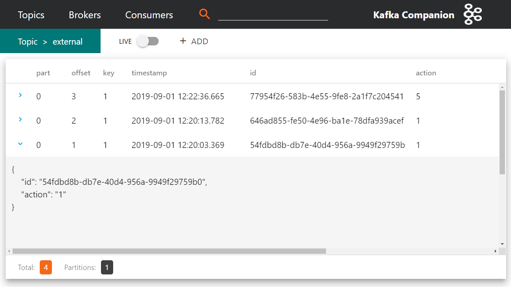

# Wprowadzenie

W każdym dostatecznie złożonym systemie informatycznym dochodzimy w pewnym momencie do miejsca, w którym musimy sobie odpowiedzieć na pytanie: a co jeśli coś pójdzie nie tak. Jeśli mamy szczęście, to może się okazać, że rozwiązania, które wybraliśmy, dostarczają nam gotowe narzędzia do radzenia sobie w sytuacjach wyjątkowych. Może też się okazać, że nie mieliśmy tyle szczęścia i wybraliśmy Kafkę...
 
 W niniejszym wpisie znajdziesz odpowiedź na to, dlaczego w Kafce nie ma DLQ (ang. Dead Letter Queue) oraz jak sobie poradzić w sytuacji, gdy potrzebujesz takiego mechanizmu w swoim systemie. 

# Dlaczego w Kafce nie ma DLQ
Zacznijmy zatem od odpowiedzi na to pytanie. Przecież większość popularnych systemów kolejkowych takich jak RabbitMQ czy ActiveMQ mają wbudowane systemy odpowiedzialne za niezawodne dostarczanie komunikatów, dlaczego zatem Kafka nie oferuje takowego. Odpowiedź na to pytanie ściśle związana jest z jednym z rozwiązań architektonicznych leżących u podstaw działania Kafki: głupi broker i sprytny konsument (ang. dumb broker / smart consumer). Wzorzec ten sprowadza się do tego, że ciężar logiki związanej z obsługą odczytów przeniesiony jest na konsumenta. Konsekwencją takiego rozwiązanie jest zatem brak gotowego rozwiązania mogącego wspomóc konsumenta w przypadku wystąpienia problemu podczas przetwarzania komunikatu. Broker jest zainteresowany tylko jedną informacją: pozycją, na której konsument zakończył przetwarzanie (ang. commit offset). 
Oczywiście zawsze można rzec, że w ten sytuacji należy dobrać odpowiednie narzędzie do problemu i zastosować system kolejkowy mający takie wsparcie. Nie zawsze jednak mamy nieograniczoną swobodę wprowadzania wielu rozwiązań w jednym systemie. Jeśli tak jak ja wybraliście Kafkę jako silnik rejestrujący zdarzenia, to w przypadku wystąpienia opisywanego problemy musicie poradzić sobie sami i odpowiednio oprogramować taką sytuację. 
   
# Jak sobie radzić z błędami
 Wyobraźmy sobie sytuację, w której elementem procesu obsługi zdarzenia jest komunikacja z zewnętrznym systemem. Musimy przemyśleć i podjąć decyzję jak ma zachować się konsument w momencie, gdy zewnętrzny system odpowiada w inny sposób, niż się spodziewaliśmy albo, co gorsza - w ogóle nie odpowiada. Jest wiele strategii obsługi takiej sytuacji. Ja na potrzeby tego artykułu wybrałem cztery, które doprowadzą nas do rozwiązania, którego implementacja zostanie zaprezentowana w kolejnych akapitach 
## Brak

Bardzo popularna i niezwykle często stosowana strategia obsługi sytuacji wyjątkowych, to brak reakcji. Na powyższym rysunku prostokąty oznaczają kolejne wiadomości w topiku. Gdy konsument napotka problem z przetwarzaniem komunikatu o offsecie 1486, ignoruje go i przechodzi do następnego. I mimo, że takie podejście wydaje się niezbyt dobrym rozwiązaniem, to istnieją sytuacje, gdy utrata części komunikatów nie niesie za sobą dużego ryzyka. Za przykład można podać wszelkie rozwiązania przechowujące i analizujące zachowanie użytkowników pracujących z aplikacją. Ponieważ zadaniem takiego systemu jest zbieranie danych statystycznych, utrata pojedynczych zdarzeń nie wpływnie znacząco na wyniki. Ważne jest jednak, żeby w takiej sytuacji dysponować skutecznym monitoringiem, który wychwyci sytuację, w której utrata komunikatów przekracza pewien arbitralnie ustalony poziom.
 
## Nieskończone ponawianie w miejscu

Gdy nie możemy pozwolić sobie na utratę komunikatów, najprostszym podejściem jest ponawianie do skutku. Oczywistą konsekwencją jest tzw. zatrzymanie świata. Dopóki błąd nie zostanie poprawiony albo zewnętrzny system udrożniony - żaden kolejny komunikat nie zostanie przetworzony. Takie rozwiązanie jest jednak konieczne w przypadku, gdy bezwzględnie zachować kolejność przetwarzania zdarzeń systemie. W ten scenariusz także wpisuje się potrzeba stałego monitoringu.
 
## Skończone ponawianie w miejscu z topikiem błędów
 
Wyobraźmy sobie teraz co się stanie, jak nieco poluzujemy to wymaganie bezwzględnego zachowania kolejności. Załóżmy, że próbujemy przez jakiś czas ponawiać, ponieważ statystyka i doświadczenie podpowiada nam, że 99% problemów z przetwarzaniem komunikatów jest chwilowych i samoczynnie ustępuje po pewnym czasie. Dodatkowo komunikaty, których nie udało się przetworzyć, **kopiujemy** na oddzielny topik traktowany jako DLQ. Dzięki temu mamy od razu wyłuskane problematyczne komunikaty i możemy puścić na nim osobną grupę konsumentów. 

Krótkie wyjaśnienie, dlaczego komunikaty są **kopiowane** a nie przenoszone. Odpowiedź jest bardzo prosta - nie mogą być przeniesione. Wynika to z kolejnego fundamentu architektonicznego Kafka czyli niezmienności topików (ang. immutable topics). Niezależnie jaka była przyczyna błędu, komunikat na zawsze pozostanie utrwalony. Istnieją jednak sposoby na radzenie sobie z tym ale o tym później. 
 
## Skończone ponawianie na wydzielonym topiku

Dochodzimy niniejszym do naszego ostatecznego rozwiązania. Skoro mamy osobny topik dla zepsutych wiadomości to może warto także wprowadzić taki, na którym odbywa się ponawianie. W tym modelu jeszcze bardziej luzujemy konieczność zachowania kolejności ale dostajemy w zamian możliwość bezprzerwowego przetwarzania głównego topika. Wiadomości kaskadowo kopiowane są najpierw na topik wiadomości ponawianych a w przypadku niepowodzenia - topik DLQ (technicznie powinniśmy nazwać go DLT, ale zostańmy przy nazewnictwie DLQ). 

W systemie, na podstawie którego powstał ten wpis, występuje wszystkie 4 opisywane warianty postępowania w sytuacji awaryjnej. Cała zabawa polega na dopasowania odpowiedniej metody do natury danych przetwarzanych w topiku. Warto też zaznaczyć, że warto uczyć się od największych i dwa ostatnie modele są mocno inspirowane sposobem, w jaki Kafkę w swoich systemach używa Uber. 

# Implementacje
Mając za sobą część teoretyczną, możemy w końcu przejść do kodu. Poglądową aplikację, z której pochodzą poniższe snippety, znajdziecie pod adresem https://github.com/ynleborg/kafka-reliable-consumers. Od razu zaznaczam, że nie jest to coś, z czym można by pójść od razu na produkcję. Chodzi bardziej o zarysowanie sposobu, w jaki można wdrożyć ostatnią strategię.

## Konsument głównego topika

```java
    @KafkaListener(topics = "${topic.main}")
    public void consumeFromMainTopic(String message,
                                     @Header(KafkaHeaders.RECEIVED_MESSAGE_KEY) String key,
                                     @Header(KafkaHeaders.OFFSET) String offset) {
        log.info("Consume from main topic [key={}, offset={}, message={}]", key, offset, message);
        Message serializedMessage;
        try {
            serializedMessage = objectMapper.readValue(message, Message.class);
            restTemplate.getForEntity(POSTMAN_RESOURCE_URL + serializedMessage.getAction(), String.class);
            log.info("Done processing [key={}, offset={}]", key, offset);
        } catch (Exception e) {
            log.error("Cannot handle message: {}", e.getMessage());
            copyMessageToRetry(message);
        }
    }
```
Większość przykładów i kursów używa niskopoziomowego klienta dostarczonego przez Apache, który może nieco przerazić mniej doświadczonych programistów konstrukcją wykorzystującą nieskończoną pętlę. Nie ma się czego bać, jest to po prostu konstrukcja wynikająca ze sposobu w jaki klient Kafki działa. Nie zmienia to jednak faktu, że nawet prosty odczyt wymaga nieco kodu. Można to znacznie uprościć, wykorzystując implementację opakowującą ten boilerplate kod, dostarczoną przez Springa. Tak też zostało to zaproponowane w niniejszym przykładnie, mamy więc Kafka Listenera zapiętego na zdarzenia z głównego topika. Dodatkowo wstrzykujemy elementy nagłówka wiadomości, żeby można było na podstawie logów prześledzić procesowanie. Sama implementacja jest w tym przypadku bardzo prosta. Wywołujemy zewnętrzny serwis i w przypadku błędów, kopiujemy wiadomość do topika realizującego ponawianie.

W celu zasymulowania problemów z czasem odpowiedzi zewnętrznego systemu, wykorzystamy tutaj publicznie dostępne API udostępnione przez Postmana (https://docs.postman-echo.com) a w szczególności endpoint /delay. Dzięki mnogości dostępnych zachować Postman Echo świetnie sprawdza się w testach integracyjnych z zewnętrznym systemem.

## Konsument topika do ponawiania

```java
    @KafkaListener(topics = "${topic.retry}")
    public void consumeFromRetryTopic(String message,
                                      @Header(KafkaHeaders.RECEIVED_MESSAGE_KEY) String key,
                                      @Header(KafkaHeaders.OFFSET) String offset) {
        log.info("Consume from retry topic [key={}, offset={}, message={}]", key, offset, message);
        Message serializedMessage;
        long loop = 1;
        boolean success = false;
        while (loop <= 3 && !success) {
            try {
                serializedMessage = objectMapper.readValue(message, Message.class);
                Thread.sleep(loop * 500);
                log.info("Retrying message in loop {}", loop);
                restTemplateForRetrying.getForEntity(POSTMAN_RESOURCE_URL + serializedMessage.getAction(), String.class);
                success = true;
                log.info("Done processing [key={}, offset={}]", key, offset);
            } catch (Exception e) {
                log.error("Cannot handle message {}", e.getMessage());
            }
            loop++;
        }
        if (!success) {
            copyMessageToDlq(message);
        }
    }
```

Konsument topika ponawiającego podejmuje trzy próby przetworzenia wiadomości. Realizuje on też koncept polegający na to, że każda następna próba jest bardziej oddalona w czasie. W tej konkretnej implementacji jest to po prosty wynik mnożenia numeru iteracji przez 500. Jeżeli uda się przetworzyć wiadomość to konsument przechodzi do kolejnej, jeśli nie - kopiuje do DLQ.

## Konsument DLQ

```java
    @KafkaListener(topics = "${topic.dlq}")
    public void consumeFromDlqTopic(String message,
                                    @Header(KafkaHeaders.RECEIVED_MESSAGE_KEY) String key,
                                    @Header(KafkaHeaders.OFFSET) String offset) {
        log.error("Consume from DLQ topic [key={}, offset={}, message={}]", key, offset, message);
    }
```

W przypadku podglądowej aplikacji konsument DLQ wypisuje tylko wiadomość na ekranie. Natomiast w docelowych rozwiązaniach jest to dobre miejsce na zbieranie statystyk o częstotliwości oraz przyczynie błędów i uruchamianie w systemie alertów. 

# Uruchomienie przykładu
Po uruchomieniu aplikacji możemy zacząć bombardować ją wiadomościami. Użyję w tym celu narzędzia Kafka Companion, które sami przygotowaliśmy w trakcie prac z Kafką. Aplikacja jest darmowa i dostępna na naszym GitHubie (https://github.com/Consdata/kafka-companion). O tym jakie ma możliwości i dlaczego powstało, będziecie mogli przeczytać w moim kolejnym wpisie na blogu.
 

## Poprawnie przetworzona wiadomość

```
Consume from main topic [key=1, offset=0, message={
    "id" : "5dad21b1-9f5c-4b67-a583-dfad8b00b0b5",
    "action" : "0"
}]
Done processing [key=1, offset=0]
```
Wysłanie wiadomości z action=0 spowoduje, że Postman Echo odpowiada bez zwłoki i przetwarzanie kończy się na głównym topiku.
 
## Wiadomość ponawiana - poprawnie przetworzona

```
Consume from main topic [key=1, offset=2, message={
    "id" : "646ad855-fe50-4e96-ba1e-78dfa939acef",
    "action" : "1"
}]
Cannot handle message: I/O error on GET request for "https://postman-echo.com/delay/1": Read timed out
Copying message [target=external-retry, key=2019-09-01]
Consume from retry topic [key=2019-09-01, offset=1, message={
    "id" : "646ad855-fe50-4e96-ba1e-78dfa939acef",
    "action" : "1"
}]
Retrying message in loop 1
Done processing [key=2019-09-01, offset=1]
```

Aplikacja korzysta z dwóch RestTemplatów o innej konfiguracji timeoutów. Ten główny czeka maksymalnie 900ms, podczas gdy ten ponawiający 1900ms. Jest to wygodne na nasze potrzeby prezentacyjne, ale warto także zaznaczyć, że w docelowym rozwiązaniu również należy rozważyć rozdzielenie konfiguracji. Ponieważ w tym modelu główny topik nie jest blokowany przez niepowodzenia, można bardziej liberalnie skonfigurować połączenie do zewnętrznego systemu w przypadku konsumenta ponawiającego. 

## Wiadomość w DLQ

```
Consume from main topic [key=1, offset=3, message={
    "id" : "77954f26-583b-4e55-9fe8-2a1f7c204541",
    "action" : "5"
}]
Cannot handle message: I/O error on GET request for "https://postman-echo.com/delay/5": Read timed out
Copying message [target=external-retry, key=2019-09-01]
Consume from retry topic [key=2019-09-01, offset=2, message={
    "id" : "77954f26-583b-4e55-9fe8-2a1f7c204541",
    "action" : "5"
}]
Retrying message in loop 1
Cannot handle message I/O error on GET request for "https://postman-echo.com/delay/5": Read timed out
Retrying message in loop 2
Cannot handle message I/O error on GET request for "https://postman-echo.com/delay/5": Read timed out
Retrying message in loop 3
Cannot handle message I/O error on GET request for "https://postman-echo.com/delay/5": Read timed out
Copying message [target=external-dlq, key=2019-09-01]
Consume from DLQ topic [key=2019-09-01, offset=0, message={
    "id" : "77954f26-583b-4e55-9fe8-2a1f7c204541",
    "action" : "5"
}]
```
Trzeci i ostatni przykład zadaje 5 sekundowe opóźnienie i wiemy z naszej konfiguracji, że taki komunikat na pewno nie zostanie przetworzony i trafi ostatecznie do DLQ. Wprawne oko zauważy, że w podczas kopiowania nadawany jest inny klucz, w tym przypadku oznaczający dzień wystąpienia błędu. Będzie to istotne w kolejnym punkcie.

# Sprzątanie.
Na zakończenie pozostaje jeszcze rozwiązanie problemu związanego z redundancją danych wynikającą z faktu kopiowania wiadomości pomiędzy topikami. W przypadku głównego topika mamy sytuację, że każda wiadomość, która ostatecznie trafiła do DLQ uznawana jest za uszkodzoną. Jeśli w naszej aplikacji jest możliwość ponownego przetworzenia strumienia wiadomości, to musimy jakoś obsłużyć tę sytuację. Istnieją co najmniej dwa rozwiązanie: 
* rejestr uszkodzonych wiadomości - może być budowany automatycznie na podstawie wiadomości trafiających do DLQ. Składają się na niego offsety wiadomości z głównego topika. Podczas ponownego przetworzenia konsument wiedząc o tym rejestrze pomija te wszystkie wiadomości, które są w nim oznaczone.
* kompaktowanie - Napisałem wcześniej, że nie można zmieniać i usuwać wiadomości w topiku. Jest od tej reguły wyjątek i związany jest z mechanizmem kompaktowania topiku. W największym skrócie działa to w ten sposób, że broker uruchamia cyklicznie zadanie, które przegląda topik, zbiera wiadomości o tym samym kluczu i pozostawia tylko tą najnowszą. Trik polega więc na tym, żeby wstawić do strumienia wiadomość o tym samym kluczu co uszkodzona ale o pustej treści. Oczywiście konsument musi wcześniej być przygotowany na obsługę takich wiadomości.
Można obie techniki stosować jednocześnie, należy jednak pamiętać, że offsety skompaktowanych wiadomości znikną bezpowrotnie z topiku. 

Topik retry zawiera wiadomości, które po przetworzeniu nie mają żadnej wartości, więc w tym przypadku wystarczy skonfigurować retencję, czyli czas życia wiadomości. Trzeba tylko pamiętać, żeby retencja nie była krótsza, niż najdłuższy możliwy czas przetwarzania pojedynczej wiadomości. 

Topik DLQ powinien zawierać wiadomości dopóki, dopóty nie zostaną zdiagnozowane a system - poprawiony. Jako, że ten czas nie jest łatwy do ustalenia to nie wchodzi w rachubę retencja. Dlatego też trik z kluczami opartymi na datach. Jeśli uznajemy, że incydenty z określonego dnia zostały rozwiązane, to wprowadzamy do DLQ pusty komunikat z kluczem takim jak dzień i przy najbliższej sesji kompaktowania - wszystkie wiadomości zostaną usunięte z DLQ. 

# Podsumowanie
W ten oto sposób dobrnęliśmy do końca. Liczę, że udało mi się zaprezentować na tym prostym przykładzie, że iteracyjne podejście do problemu potrafi doprowadzić nas do ciekawych i skutecznych rozwiązań.

# Zaproszenie na 4developers
Jeżeli zainteresowałą was tematyka poruszana w tym artykule to serdecznie zapraszam was na moje wystąpienie na 4Developers, gdzie postaram się ten temat jeszcze bardziej zgłębić. Wielkopolska edycja 4Developers odbędzie się 18.11. Ścieżki tematyczne, jakie pojawią się w Poznaniu, to: .NET, Architektury Aplikacji, Java, JavaScript 

Tutaj zdobędziecie bilety -> https://evenea.pl/event/4developerspoznan2019/
